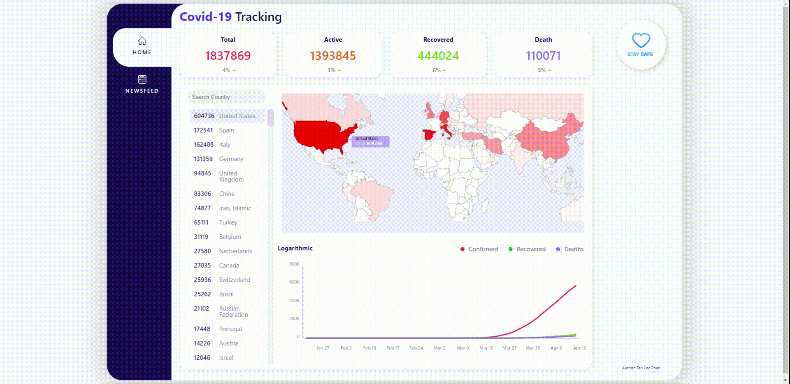

# Track Covid19

[https://track-covid19.net](http://track-covid19.net)

**Track Covid19** is my _"one weekend"_ project. It is my version of the COVID-19 virus stat-tracking website. (Yes I know there are thousands of good similar websites out there, but it was still fun to do)

### Features:

- Stats
- Global Heatmap
- Graph for each country's case history
- News

### Credit:

- Design: https://dribbble.com/shots/10796247-Corona-Covid19-Situation-Live-Board
- Icons: www.freepik.com, https://lottiefiles.com/18168-stay-safe-stay-home
